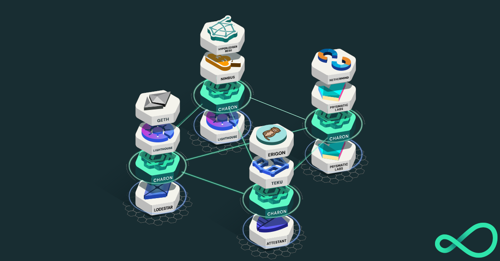

<div align="center"></div>
<h1 align="center">Charon<br/>The Distributed Validator middleware client</h1>

<p align="center"><a href="https://github.com/obolnetwork/charon/releases/"></a>
<a href="https://github.com/ObolNetwork/charon/blob/main/LICENSE"></a>
<a href="https://godoc.org/github.com/obolnetwork/charon"></a>
<a href="https://goreportcard.com/report/github.com/obolnetwork/charon"></a>
<a href="https://github.com/ObolNetwork/charon/actions/workflows/golangci-lint.yml"></a></p>

## 🌟 Overview

Charon (pronounced 'kharon') is a powerful HTTP middleware client for Ethereum Staking that revolutionizes validator operations by enabling distributed validator technology (DVT). It allows you to run a single validator safely across multiple independent nodes, significantly improving reliability and security.

### Key Benefits
- 🛡️ **Enhanced Security**: Distribute signing responsibilities across multiple nodes
- 🔄 **High Availability**: Maintain validator uptime even if some nodes fail
- 🌐 **Client Diversity**: Run different client implementations to reduce systemic risks
- 🤝 **Reduced Single Point of Failure**: No single node can compromise the validator



## 💻 System Requirements

- Go 1.20 or later
- 4GB RAM minimum
- 2 CPU cores minimum
- 20GB free disk space
- Stable internet connection

## 🚀 Quickstart

The fastest way to experience Charon is through our [charon-distributed-validator-cluster](https://github.com/ObolNetwork/charon-distributed-validator-cluster) repo:

```bash
git clone https://github.com/ObolNetwork/charon-distributed-validator-cluster
cd charon-distributed-validator-cluster
docker-compose up
```

## 📚 Documentation

Visit our comprehensive documentation at [Obol Docs](https://docs.obol.tech/):
- [📖 Introduction](https://docs.obol.tech/docs/intro)
- [🔑 Key Concepts](https://docs.obol.tech/docs/int/key-concepts)
- [⚙️ Charon Guide](https://docs.obol.tech/docs/charon/intro)

### Technical Documentation
- [Configuration](docs/configuration.md)
- [Architecture](docs/architecture.md)
- [Project Structure](docs/structure.md)
- [Contributing Guidelines](docs/contributing.md)

This repo contains the source code for the distributed validator client _Charon_ (pronounced 'kharon'); a HTTP middleware client for Ethereum Staking that enables you to safely run a single validator across a group of independent nodes.

Charon is accompanied by a webapp called the [Distributed Validator Launchpad](https://holesky.launchpad.obol.tech/) for distributed validator key creation.

Charon is used by stakers to distribute the responsibility of running Ethereum Validators across a number of different instances and client implementations.

###### A Distributed Validator Cluster that uses the Charon client to hedge client and hardware failure risks

## Quickstart

The easiest way to test out charon is with the [charon-distributed-validator-cluster](https://github.com/ObolNetwork/charon-distributed-validator-cluster) repo
which contains a docker compose setup for running a full charon cluster on your local machine.

## Documentation

The [Obol Docs](https://docs.obol.tech/) website is the best place to get started.
The important sections are [intro](https://docs.obol.tech/docs/intro),
[key concepts](https://docs.obol.tech/docs/int/key-concepts) and [charon](https://docs.obol.tech/docs/charon/intro).

For detailed documentation on this repo, see the [docs](docs) folder:

- [Configuration](docs/configuration.md): Configuring a charon node
- [Architecture](docs/architecture.md): Overview of charon cluster and node architecture
- [Project Structure](docs/structure.md): Project folder structure
- [Branching and Release Model](docs/branching.md): Git branching and release model
- [Go Guidelines](docs/goguidelines.md): Guidelines and principals relating to go development
- [Contributing](docs/contributing.md): How to contribute to charon; githooks, PR templates, etc.

There is always the [charon godocs](https://pkg.go.dev/github.com/obolnetwork/charon) for the source code documentation.

## Project Status

A table detailing Charon compatibility with upstream consensus clients and downstream validators can be found [in the changelog](https://github.com/ObolNetwork/charon/releases) of each release, in the **Compatibility Matrix** section.

## Version compatibility

Considering [semver](https://semver.org) as the project's versioning scheme, two given versions of Charon are:
 - **compatible** if their `MAJOR` number is the same, `MINOR` and `PATCH` numbers differ
 - **incompatible** if their `MAJOR` number differs

There are several reasons to justify a new `MAJOR` release, for example:
 - a new Ethereum hardfork
 - an old Ethereum hardfork is removed due to network inactivity
 - modifications to the internal P2P network or consensus mechanism requiring deep changes to the codebase

The `charon dkg` subcommand **is more restrictive** than this general compatibility promise; all peers should use matching`MAJOR` and`MINOR` versions of Charon for the DKG process, patch versions may differ though it is recommended to use the latest patch of any version.
