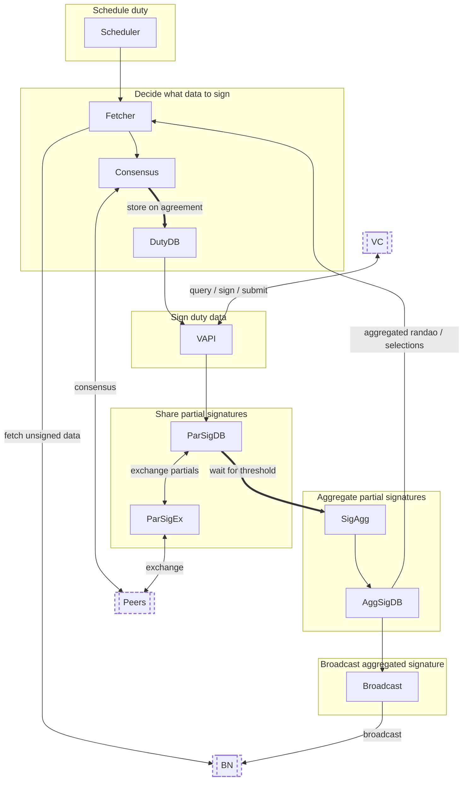
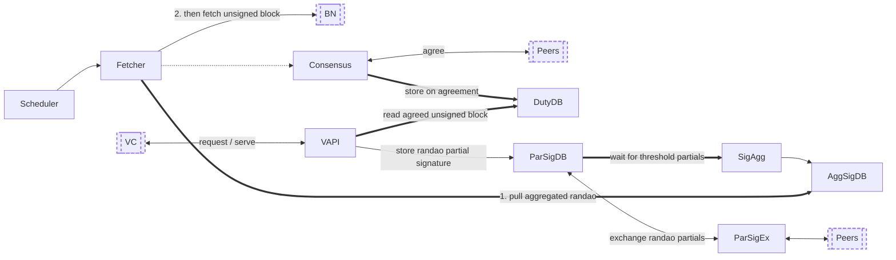
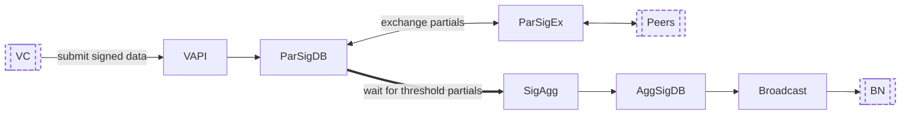
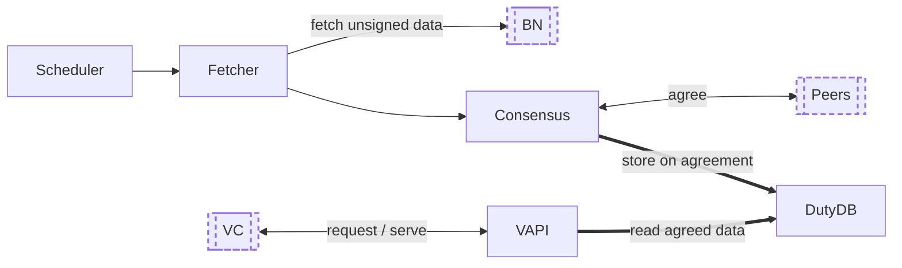
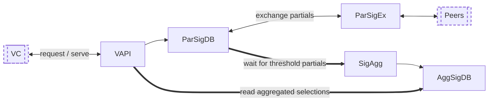
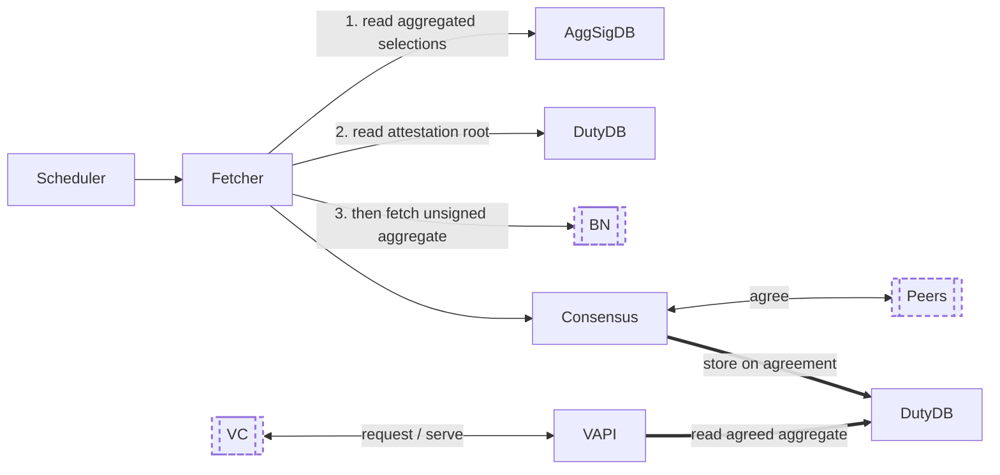
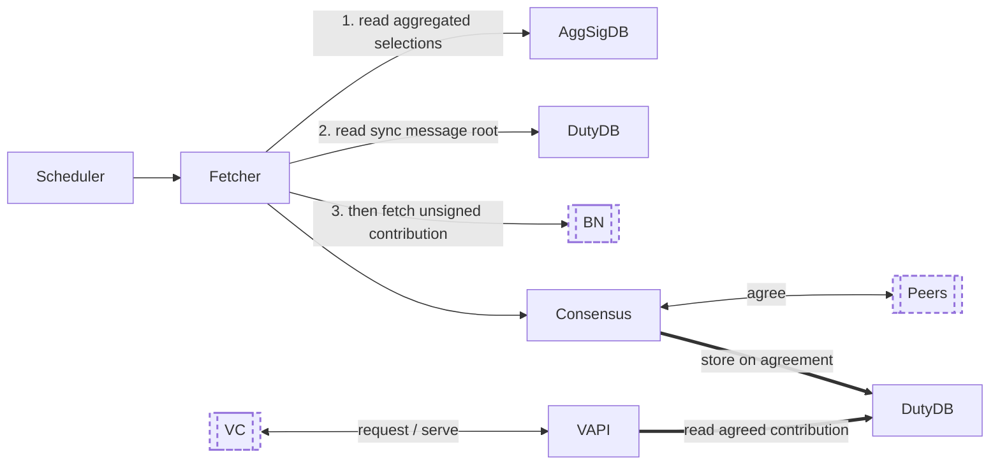
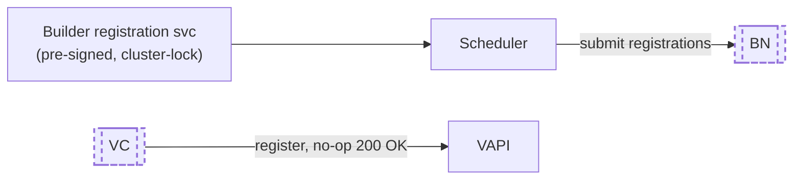

# Charon Architecture

This document describes the Charon middleware architecture both from cluster level and a node level.

> ℹ️ The Go interface snippets in this document are illustrative copies.
> The source of truth for all core workflow interfaces is [core/interfaces.go](../core/interfaces.go).

Related documents:
- [Consensus](consensus.md): Consensus protocols, cluster-wide protocol negotiation and observability
- [Duty Failure Reasons](reasons.md): Failure reasons recorded by the tracker
- [Project Structure](structure.md): Package structure of the repo
- [Metrics](metrics.md): Prometheus metrics exposed by a charon node

## Cluster Architecture

```
                ┌────┐    ┌────┐   ┌────┐
                │BN#1│    │BN#2│   │BN#n│
                └─▲──┘    └─▲──┘   └─▲──┘
                  │         │        │
       ┌──────────┼─────────┼────────┼──────┐
       │Charon    │         │        │      │
       │Cluster┌──┴───┐  ┌──┴───┐ ┌──┴───┐  │
       │       │ CN#1 │  │ CN#2 │ │ CN#n │  │
       │       │    ◄─┼──┼─►  ◄─┼─┼─►    │  │
       │       └──▲───┘  └──▲───┘ └──▲───┘  │
       │          │         │        │      │
       └──────────┼─────────┼────────┼──────┘
                  │         │        │
                ┌─┴──┐    ┌─┴──┐   ┌─┴──┐
                │VC#1│    │VC#2│   │VC#n│
                └────┘    └────┘   └────┘
               PPS#1/1   PPS#2/1   PPS#n/1
               PPS#1/2   PPS#2/2   PPS#n/2
               PPS#1/m   PPS#2/m   PPS#n/m
```

- **CN**: `n` physical charon nodes (peers)
- **BN**: `+-n` physical beacon nodes (can be more/less, at least 1 per Charon node, can be shared, but it is discouraged)
- **VC**: `n` physical validator clients (`1` per CN)
- **PPS**: `nXm` physical private partial shares (`m` per VC, `n` per DV)
- Not shown:
  - `t = ceil(2n/3)` threshold signatures required per DV, so `t` charon nodes must be available and honest,
    tolerating `f = floor((n-1)/3)` byzantine/faulty nodes (BFT consensus quorum).

## Charon Node Core Workflow

Charon core business logic is modeled as a workflow, with a duty being performed in a slot as the “unit of work”.



Internal Charon components are plain boxes; external systems (`VC`, `BN`, `Peers`) use dashed, double-edged
boxes. **Thick arrows** mark a step that blocks while waiting on an externality — consensus agreeing with peers,
or a threshold of partial signatures. The same conventions are used in the [per-duty workflows](#per-duty-workflows)
below.

Not shown in the diagram:
- The **Tracker** and **InclusionChecker** observe the outputs of all components to analyse duty failures
  and verify on-chain inclusion (see [Supporting components](#supporting-components)).
- The **Priority** protocol negotiates cluster wide preferences (e.g. the consensus protocol to use).
- The Fetcher also pulls cached attestation data from the DutyDB (for aggregator duties).

### Duty
As per the Ethereum consensus [spec](https://github.com/ethereum/consensus-specs/blob/v1.1.0-alpha.2/specs/phase0/validator.md#beacon-chain-responsibilities):

> ℹ️ A validator has two primary responsibilities to the beacon chain: [proposing blocks](https://github.com/ethereum/consensus-specs/blob/02b32100ed26c3c7a4a44f41b932437859487fd2/specs/phase0/validator.md#block-proposal)
> and [creating attestations](https://github.com/ethereum/consensus-specs/blob/02b32100ed26c3c7a4a44f41b932437859487fd2/specs/phase0/validator.md#attesting).
> Proposals happen infrequently, whereas attestations should be created once per epoch.

Even though the validator has different duties, they all follow the same process, we can therefore model the core business
logic as single workflow being performed on an abstract duty. A duty is always performed in a specific slot.

A duty therefore has a slot and a type and is defined as:
```go
// Duty is the unit of work of the core workflow.
type Duty struct {
	// Slot is the Ethereum consensus layer slot.
	Slot uint64
	// Type is the duty type performed in the slot.
	Type DutyType
}
```

- `type DutyType int`:
- `DutyProposer = 1`: Proposing a block
- `DutyAttester = 2`: Creating an attestation
- `DutySignature = 3`: Signing duty data
- `DutyExit = 4`: Exiting a validator
- `DutyBuilderProposer = 5`: Proposing a blinded block received from the builder network (deprecated)
- `DutyBuilderRegistration = 6`: Registering a validator to the builder network
- `DutyRandao = 7`: Creating a randao reveal signature required as input to DutyProposer
- `DutyPrepareAggregator = 8`: Preparing for aggregator ([beacon committee](https://eth2book.info/capella/part2/building_blocks/committees/), [sync committee](https://eth2book.info/capella/part2/building_blocks/sync_committees/)) duties
- `DutyAggregator = 9`: [Aggregator](https://eth2book.info/capella/part2/building_blocks/aggregator/) (beacon committee, sync committee) duty
- `DutySyncMessage = 10`: Sync message duty
- `DutyPrepareSyncContribution = 11`: Prepare sync contribution duty
- `DutySyncContribution = 12`: Sync contribution duty
- `DutyInfoSync = 13`: Sending versions of peers in a cluster over wire

> ℹ️ Duty is on a cluster level, not a DV level. A duty defines the “unit of work” for the whole cluster,
> not just a single DV. This allows the workflow to aggregate and batch multiple DVs in some steps, specifically consensus.
> Which is critical for clusters with a large number of DVs.

Not all duties flow through all workflow components.


### Per-duty workflows

Although all duties share the same component set, they do not all flow through every component.
Most duties decompose into two reusable sub-flows:

- **Serving data** — Charon fetches the unsigned duty data, reaches consensus on it, and serves it to the
  requesting VC. The scheduler-driven fetch/consensus path and the VC's data request run *concurrently* and
  convene at the `DutyDB`.
- **Submitting data** — the VC submits its partially signed data; Charon shares the partial signatures with its
  peers, aggregates them once the threshold is met, and broadcasts the fully signed result to the beacon node.

**Reading the graphs.** Internal Charon components are plain boxes; external systems — the validator client
(`VC`), the beacon node (`BN`) and the Charon peers (`Peers`) — are drawn with a dashed, double-edged box.
**Thick arrows** (`══▶`) mark a step where Charon *blocks while waiting on an externality*: consensus agreeing
with its peers, a threshold of partial signatures arriving from peers, or a blocking read of already-agreed
data; thin arrows are non-blocking.

---

#### `DutyProposer`

**Serving data** — the scheduler triggers the fetch+consensus path while the VC independently requests the same
data; the write to `DutyDB` blocks on consensus, and the VAPI blocks on `DutyDB` until the agreed data is stored,
then serves it. Additionally, the `Fetcher` first blocks on the VC's aggregated randao reveal (`DutyRandao`) —
submitted with the block request and aggregated internally via a submitting-style flow — reading it from
`AggSigDB` before fetching the proposal.



**Submitting data** — the VC signs and submits its partial; Charon collects partials from peers, blocks for the
threshold, aggregates, and broadcasts the result. The proposal is broadcast full or blinded, per the Builder API
flag.



#### `DutyAttester`

**Serving data** — the scheduler triggers the fetch+consensus path while the VC independently requests the same
data; the write to `DutyDB` blocks on consensus, and the VAPI blocks on `DutyDB` until the agreed data is stored,
then serves it.



**Submitting data** — the VC signs and submits its partial; Charon collects partials from peers, blocks for the
threshold, aggregates, and broadcasts the result.


#### `DutyAggregator`

**Pre-requisite** — the beacon-committee selections are produced by `DutyPrepareAggregator`, run **once per
epoch**. It only serves data (no consensus, no broadcast): the VC submits its partial selections, Charon
aggregates them across peers, and serves the aggregated selections back to the VC — leaving them in `AggSigDB`
for the Serving flow below to read.



**Serving data** — the scheduler triggers the fetch+consensus path while the VC independently requests the same
data; the write to `DutyDB` blocks on consensus, and the VAPI blocks on `DutyDB` until the agreed data is stored,
then serves it. Additionally, the `Fetcher` first reads the aggregated selections from `AggSigDB` (the
Pre-requisite above) and the attestation root from `DutyDB`, and only fetches for the DVs selected as aggregators.



**Submitting data** — the VC signs and submits its partial; Charon collects partials from peers, blocks for the
threshold, aggregates, and broadcasts the result.


#### `DutySyncMessage`

**Serving data** — none. The data a sync message signs (the head block root) is obtained by the VC itself, through general-purpose beacon endpoints (e.g. `GET /eth/v1/beacon/blocks/head/root`) that different clients query via different requests and events, at different points in the slot. Intercepting these to reach consensus would harm rather than help cluster consistency, so Charon does not serve this data; it instead relies on a threshold of nodes independently converging on the same head root, and the duty fails if that threshold is not met.

In practice this often outperforms forcing agreement on a single (possibly stale) leader's head: for example, in a 5/7 cluster where one node consistently sees a stale head while the other six see the latest, the six always meet threshold and the cluster submits correct sync messages — whereas leader-based agreement would select the stale head roughly 1 in 7 times and submit an incorrect one.

**Submitting data** — the VC signs and submits its partial; Charon collects partials from peers, blocks for the
threshold, aggregates, and broadcasts the result.


#### `DutySyncContribution`

**Pre-requisite** — the sync-committee selections are produced by `DutyPrepareSyncContribution`, run **once per
epoch**. It only serves data (no consensus, no broadcast): the VC submits its partial selections, Charon
aggregates them across peers, and serves the aggregated selections back to the VC — leaving them in `AggSigDB`
for the Serving flow below to read.


**Serving data** — the scheduler triggers the fetch+consensus path while the VC independently requests the same
data; the write to `DutyDB` blocks on consensus, and the VAPI blocks on `DutyDB` until the agreed data is stored,
then serves it. Additionally, the `Fetcher` first reads the aggregated selections from `AggSigDB` (the
Pre-requisite above) and the sync message root from `DutyDB`.



**Submitting data** — the VC signs and submits its partial; Charon collects partials from peers, blocks for the
threshold, aggregates, and broadcasts the result.


#### `DutyExit`

**Serving data** — none: the VC produces the voluntary exit itself, so there is nothing to fetch or agree.

**Submitting data** — the VC signs and submits its partial; Charon collects partials from peers, blocks for the
threshold, aggregates, and broadcasts the result.


#### `DutyBuilderRegistration`

**Serving data** — none: there is nothing to fetch or agree.

**Submitting data** — not the standard flow: the VAPI register endpoint is a no-op, and the Scheduler submits the
pre-signed registrations directly to the beacon node in the first slot of each epoch (see
[DutyBuilderRegistration redesign](#dutybuilderregistration-redesign)).



### DutyBuilderProposer deprecation
The new version of Beacon API spec introduced [produceBlockV3](https://ethereum.github.io/beacon-APIs/#/Validator/produceBlockV3) endpoint,
which is now fully supported by Charon (since v1).

Previously, `DutyProposer` and `DutyBuilderProposer` served full and blinded blocks respectively.
Now, `DutyProposer` serves both full and blinded blocks. To this end, the serialization logic incorporated `Blinded` flag,
which is used across many components to determine the corresponding block type.
The deprecated `DutyBuilderProposer` definition is kept in the codebase for testing period and will be removed in the future.
Every component hitting `DutyBuilderProposer`, must return `ErrDeprecatedDutyBuilderProposer` error.

The new v3 endpoint specification added a few new parameters and this is how Charon handles them:
* `builder_boost_factor`: Charon overrides VC's value in according with Builder API flag: when the flag is `true`, Charon sets `builder_boost_factor` to `math.MaxUint64`, otherwise to `0`. To guarantee consistency, all Charon nodes in a cluster shall have the same Builder API flag.
* `Eth-Execution-Payload-Value` and `Eth-Consensus-Block-Value` are always set to `1`, since these are required parameters. Charon does not propagate BN's values to VC to avoid potential inconsistencies caused by different BN providers.

> ℹ️ The change in serialization (both json and ssz) introduced *a breaking change* in the internal protocol.
Therefore, Charon v1.x will not work together with Charon v0.x. See *Version compatibility* section of `README.md` for more details.

### DutyBuilderRegistration redesign

Since Charon v1.8.0, the `/eth/v1/validator/register_validator` validator API endpoint has no effect.
This endpoint now always returns HTTP 200 OK without any processing.
Now, Charon's Scheduler component is responsible for submitting builder registrations at the right times:

- At startup, it submits registrations for all DVs in the cluster (found in cluster-lock.json).
- Thereafter, it submits registrations in the first slot of every epoch (delayed to ~75% into the slot to capture timeframe with less load on the beacon node).

During the transition period, a cluster running a mix of new and old Charon versions may experience "consensus timeout" errors,
because the new version will not participate in consensus for the `DutyBuilderRegistration` duty.

Also, the old metrics `core_bcast_recast_registration_total`, `core_bcast_recast_total`, and `core_bcast_recast_errors_total` are removed in favor of new metrics: `core_scheduler_submit_registration_total` and `core_scheduler_submit_registration_errors_total`.

### Scheduler

The scheduler is the initiator of a duty in the core workflow. It resolves which DVs in the cluster are active and
is then responsible for starting a duty at the optimal time by calling the `fetcher`.

DVs are identified by their root public key `PubKey`.
```go
// PubKey is the DV root public key, the identifier of a validator in the core workflow.
// It is a hex formatted string, e.g. "0xb82bc6...."
type PubKey string
```
It resolves the status of all DVs in the cluster lock with a single bulk
[Get validators from state](https://ethereum.github.io/beacon-APIs/#/Beacon/postStateValidators) query,
served from a validator cache that is refreshed every epoch. Validators that are not found or not active
(and not activating in the current epoch) are skipped.

In the last slot of each epoch it resolves the duties for the next epoch by calling
[Get attester duties](https://ethereum.github.io/beacon-APIs/#/ValidatorRequiredApi/getAttesterDuties),
[Get block proposer duties](https://ethereum.github.io/beacon-APIs/#/ValidatorRequiredApi/getProposerDuties)
and [Get sync committee duties](https://ethereum.github.io/beacon-APIs/#/ValidatorRequiredApi/getSyncCommitteeDuties)
on the beacon API (served from a duties cache by default). It caches the results and triggers each duty
when the associated slot starts. Two further duty types are derived from these definitions:
- A `DutyAggregator` is scheduled for every slot with an attester duty (attestation aggregation is only
  performed if a DV is actually selected as an aggregator, see `DutyPrepareAggregator`).
- A `DutySyncContribution` is scheduled for every slot of an epoch in which a DV is part of the sync committee.

Resolved duties are trimmed after 3 epochs.

An abstract `DutyDefinition` type is defined that represents the json formatted responses returned by the beacon node above.
Note the ETH2 spec refers to these as "duties", but we use a slightly different term to avoid overloading
the term "duty" which we defined above.
```go
// DutyDefinition defines a duty including parameters required
// to fetch the duty data, it is the result of resolving duties
// at the start of an epoch.
type DutyDefinition interface {
  // Clone returns a cloned copy of the DutyDefinition.
  Clone() (DutyDefinition, error)
  // Marshaler returns the json serialised duty definition.
  json.Marshaler
}
```

The following `DutyDefinition` implementations are provided:
 - `AttesterDefinition` which wraps the "Get attester duties" response above.
 - `ProposerDefinition` which wraps the "Get block proposer duties" response above.
 - `SyncCommitteeDefinition` which wraps the "Get sync committee duties" response above.

Since a cluster can contain multiple DVs, it may have to perform multiple similar duties for the same slot, e.g. `DutyAttester`.
Multiple `DutyDefinition`s are combined into a single `DutyDefinitionSet` that is defined as:
```go
// DutyDefinitionSet is a set of duty definitions, one per validator.
type DutyDefinitionSet map[PubKey]DutyDefinition
```

Note that `DutyRandao` and `DutyExit` aren’t scheduled by the scheduler, since they are initiated directly by the VC.
`DutyBuilderRegistration` isn’t scheduled as a workflow duty either; the scheduler submits pre-signed builder
registrations directly to the beacon node (see *DutyBuilderRegistration redesign* above).

> ℹ️ The core workflow follows the immutable architecture approach, with immutable self-contained values flowing between components.
> Values can be thought of as events or messages and components can be thought of as actors consuming and generating events.
> This however requires that values are immutable. All abstract value types therefore define a `Clone` method
> that must be called before a value leaves its scope (shared, cached, returned etc.).

The scheduler interface is defined as:
```go
// Scheduler triggers the start of a duty workflow.
type Scheduler interface {
  // SubscribeDuties subscribes a callback function for triggered duties.
  SubscribeDuties(func(context.Context, Duty, DutyDefinitionSet) error)

  // SubscribeSlots subscribes a callback function for triggered slots.
  SubscribeSlots(func(context.Context, Slot) error)

  // GetDutyDefinition returns the definition set for a duty if already resolved.
  GetDutyDefinition(context.Context, Duty) (DutyDefinitionSet, error)

  // RegisterFetcherFetchOnly registers the fetcher's FetchOnly method
  // used for early attestation data fetching on SSE head events.
  RegisterFetcherFetchOnly(func(context.Context, Duty, DutyDefinitionSet, string, eth2p0.Root) error)
}
```
> ℹ️ Components of the workflow are decoupled from each other. They are stitched together by callback subscriptions.
> This improves testability and avoids the need for mocks. It also allows defining both inputs and outputs in the interface.
> It also allows for cyclic dependencies between components.

### Fetcher
The fetcher is responsible for fetching input data required to perform the duty.

For `DutyAttester` it [fetches AttestationData](https://github.com/ethereum/beacon-APIs/blob/master/validator-flow.md#/ValidatorRequiredApi/produceAttestationData) from the beacon node.

For `DutyProposer` it fetches a previously aggregated randao reveal signature from the `AggSigDB` and then
[fetches a block proposal](https://ethereum.github.io/beacon-APIs/#/Validator/produceBlockV3)
from the beacon node (setting `builder_boost_factor` according to the Builder API flag and applying the configured graffiti).

For `DutyAggregator` it fetches the previously aggregated beacon committee selections from the `AggSigDB`,
determines which DVs were actually selected as aggregators, and fetches the aggregate attestation from the
beacon node using the attestation data root cached in the `DutyDB`.

For `DutySyncContribution` it fetches the previously aggregated sync committee selections from the `AggSigDB`
and fetches the sync committee contribution from the beacon node.

An abstract `UnsignedData` type is defined to represent the fetched data depending on the `DutyType`.

```go
// UnsignedData represents an unsigned duty data object.
type UnsignedData interface {
  // Clone returns a cloned copy of the UnsignedData.
  Clone() (UnsignedData, error)
  // Marshaler returns the json serialised unsigned duty data.
  json.Marshaler
}
```

Since the input to fetcher is a `DutyDefinitionSet`, it fetches multiple `UnsignedData` objects for the same `Duty`.
Multiple `UnsignedData`s are combined into a single `UnsignedDataSet` that is defined as:
```go
// UnsignedDataSet is a set of unsigned duty data objects, one per validator.
type UnsignedDataSet map[PubKey]UnsignedData
```
`DutyProposer` is however unique per slot, so its `UnsignedDataSet` will only ever contain a single entry.

The unsigned duty data returned by a beacon node for a given slot is however not deterministic. It changes over time and
from beacon node to beacon node. This means that different charon nodes will fetch different input data.
This is a problem since signing different data for the same duty results in slashing.

The fetcher therefore passes the `UnsignedDataSet` as a proposal to the `Consensus` component.

The fetcher interface is defined as:
```go
// Fetcher fetches proposed unsigned duty data.
type Fetcher interface {
  // Fetch triggers fetching of a proposed duty data set.
  Fetch(context.Context, Duty, DutyDefinitionSet) error

  // FetchOnly fetches attestation data and caches it without triggering subscribers.
  FetchOnly(context.Context, Duty, DutyDefinitionSet, string, eth2p0.Root) error

  // Subscribe registers a callback for proposed unsigned duty data sets.
  Subscribe(func(context.Context, Duty, UnsignedDataSet) error)

  // RegisterAggSigDB registers a function to get resolved aggregated
  // signed data from the AggSigDB (e.g., randao reveals).
  RegisterAggSigDB(func(context.Context, Duty, PubKey) (SignedData, error))

  // RegisterAwaitAttData registers a function to get attestation data from DutyDB.
  RegisterAwaitAttData(func(ctx context.Context, slot uint64, commIdx uint64) (*eth2p0.AttestationData, error))
}
```
### Consensus
The consensus component is responsible for coming to agreement on a duty's input data (`UnsignedDataSet`) between all nodes in the cluster.
This is achieved by playing a consensus game between all nodes in the cluster. This is critical for the following reasons:

- BLS threshold signature aggregation only works if the message that was signed is identical. So all nodes need to provide the exact same duty data to their VC for signing.
- Broadcasting different signed attestations/blocks to the beacon node is a slashable offence. Note that consensus isn’t sufficient to protect against this, a slashing DB is also required.

Consensus is similar to how some blockchains decide on what blocks define the chain. Popular protocols for consensus are raft, qbft, tendermint.

The consensus requirements in DVT differ from blockchains in a few key aspects:
- Blockchains play consecutive consensus games that depend-on and follow-on the previous consensus game. Thereby creating a block “chain”.
- DVT plays single isolated consensus games.
- Blockchains play consensus games on blocks containing transactions.
- DVT plays consensus on arbitrary data, `UnsignedDataSet`

Charon's consensus is pluggable and is managed by a `ConsensusController`:
- **QBFT v2.0** (an implementation of Istanbul BFT, see [core/qbft/README.md](../core/qbft/README.md)) is the default
  protocol supported by all charon versions. It is the mandatory fallback and can never be deprecated.
- The **Priority** protocol (see [Supporting components](#supporting-components)) negotiates the cluster wide
  preferred consensus protocol once per epoch, taking into account the `consensus_protocol` cluster
  definition field and the `--consensus-protocol` CLI flag. Its outcome can switch the "current" consensus
  instance at runtime via `SetCurrentConsensusForProtocol`.

See [docs/consensus.md](consensus.md) for protocol details, round timers, observability and debugging.

A consensus game per duty is either started by `Participate` (called when the scheduler triggers the duty, allowing the
node to join the game before its own data is fetched) or by `Propose` (called with the duty data proposal from the
local node’s fetcher). Proposals contain the full `UnsignedDataSet` of the duty. A deterministic leader is elected per
round. Received consensus messages are checked by the duty gater (rejecting invalid or expired duties) and, for
attestations, the leader's proposed data can additionally be compared against the locally fetched data.
When a consensus game completes, the resulting `UnsignedDataSet` is stored in the DutyDB.

The consensus interfaces are defined as:
```go
// Consensus comes to consensus on proposed duty data.
type Consensus interface {
	P2PProtocol

	// Participate run the duty's consensus instance without a proposed value (if Propose not called yet).
	Participate(context.Context, Duty) error

	// Propose provides the consensus instance proposed value (and run it if Participate not called yet).
	Propose(context.Context, Duty, UnsignedDataSet) error

	// Subscribe registers a callback for resolved (reached consensus) duty unsigned data set.
	Subscribe(func(context.Context, Duty, UnsignedDataSet) error)
}

// ConsensusController manages consensus instances.
type ConsensusController interface {
	// Start starts the consensus controller lifecycle.
	Start(context.Context)

	// DefaultConsensus returns the default consensus instance (always QBFT v2.0).
	DefaultConsensus() Consensus

	// CurrentConsensus returns the currently selected consensus instance.
	CurrentConsensus() Consensus

	// SetCurrentConsensusForProtocol handles the Priority protocol outcome
	// and changes CurrentConsensus() accordingly.
	SetCurrentConsensusForProtocol(context.Context, protocol.ID) error
}
```

### DutyDB
The duty database persists agreed upon unsigned data sets and makes them available for querying.
It also acts as slashing database to aid in [avoiding slashing](https://github.com/ethereum/consensus-specs/blob/02b32100ed26c3c7a4a44f41b932437859487fd2/specs/phase0/validator.md#how-to-avoid-slashing)
by ensuring a single unique `UnsignedData` per `Duty,PubKey`.

The implementation is an in-memory database (`MemDB`) holding per-duty-type maps:
- Attestation data keyed by `slot,commIdx`, with a separate `slot,commIdx,valIdx` index to look up the DV public key by attestation.
- Block proposals keyed by `slot` (proposals are unique per slot).
- Aggregated attestations keyed by `slot,dataRoot,commIdx`.
- Sync committee contributions keyed by `slot,subcommIdx,blockRoot`.

Inserts are idempotent, but storing *different* data under an existing key is rejected with a "clashing" error.
This uniqueness guarantee per `Duty,PubKey` is what makes the DutyDB the slashing database of the workflow.

The `UnsignedData` might however not be available yet at the time the VC queries the `ValidatorAPI`.
The `DutyDB` therefore provides a blocking query API. Queries block until the requested data is available or until the VC decides to timeout.

Old entries are trimmed when their duty deadline expires (see `Deadliner` under [Supporting components](#supporting-components)).

The duty database interface is defined as:
```go
// DutyDB persists unsigned duty data sets and makes it available for querying. It also acts
// as slashing database.
type DutyDB interface {
	// Store stores the unsigned duty data set.
	Store(context.Context, Duty, UnsignedDataSet) error

	// AwaitProposal blocks and returns the proposed beacon block
	// for the slot when available.
	AwaitProposal(ctx context.Context, slot uint64) (*eth2api.VersionedProposal, error)

	// AwaitAttestation blocks and returns the attestation data
	// for the slot and committee index when available.
	AwaitAttestation(ctx context.Context, slot, commIdx uint64) (*eth2p0.AttestationData, error)

	// PubKeyByAttestation returns the validator PubKey for the provided attestation data
	// slot, committee index and validator index. This allows mapping of attestation
	// data response to validator.
	PubKeyByAttestation(ctx context.Context, slot, commIdx, valIdx uint64) (PubKey, error)

	// AwaitAggAttestation blocks and returns the aggregated attestation for the slot
	// and attestation when available.
	AwaitAggAttestation(ctx context.Context, slot uint64, attestationRoot eth2p0.Root,
		committeeIndex eth2p0.CommitteeIndex) (*eth2spec.VersionedAttestation, error)

	// AwaitSyncContribution blocks and returns the sync committee contribution data for the slot and
	// the subcommittee and the beacon block root when available.
	AwaitSyncContribution(ctx context.Context, slot, subcommIdx uint64, beaconBlockRoot eth2p0.Root) (*altair.SyncCommitteeContribution, error)
}
```
### Validator API
The validator API provides a [beacon-node API](https://ethereum.github.io/beacon-APIs/#/ValidatorRequiredApi) to downstream VCs,
intercepting some calls and proxying others directly to the upstream beacon node.
It mostly serves unsigned duty data requests from the `DutyDB` and sends the resulting partially signed duty objects to the `ParSigDB`.

Partial signed duty data values are defined as `ParSignedData` which extend `SignedData` values:
```go
// SignedData is a signed duty data.
type SignedData interface {
  // Signature returns the signed duty data's signature.
  Signature() Signature
  // SetSignature returns a copy of signed duty data with the signature replaced.
  SetSignature(Signature) (SignedData, error)
  // MessageRoot returns the message root for the unsigned data.
  MessageRoot() ([32]byte, error)
  // Clone returns a cloned copy of the SignedData.
  Clone() (SignedData, error)
  // Marshaler returns the json serialised signed duty data (including the signature).
  json.Marshaler
}

// ParSignedData is a partially signed duty data only signed by a single threshold BLS share.
type ParSignedData struct {
  // SignedData is a partially signed duty data.
  SignedData
  // ShareIdx returns the threshold BLS share index.
  ShareIdx int
}
```

`SignedData` implementations are provided for all signed duty objects (see [core/signeddata.go](../core/signeddata.go)):
`Attestation` and `VersionedAttestation`, `VersionedSignedProposal` (both full and blinded blocks, distinguished by its
`Blinded` flag), `SignedVoluntaryExit`, `VersionedSignedValidatorRegistration`, `SignedRandao`, `BeaconCommitteeSelection`,
`SyncCommitteeSelection`, `SignedAggregateAndProof` and `VersionedSignedAggregateAndProof`, `SignedSyncMessage`,
`SyncContributionAndProof` and `SignedSyncContributionAndProof`.

Multiple `ParSignedData` are combined into a single `ParSignedDataSet` defines as follows:
```go
// ParSignedDataSet is a set of partially signed duty data objects, one per validator.
type ParSignedDataSet map[PubKey]ParSignedData
```

The validator API intercepts the following endpoints (all other calls are transparently proxied to the upstream beacon node):

| Endpoint                                                       | Handling                                                                                                                                                       |
|----------------------------------------------------------------|----------------------------------------------------------------------------------------------------------------------------------------------------------------|
| `POST /eth/v1/validator/duties/attester/{epoch}`               | Intercepted to map DV pubkeys to public shares in the response.                                                                                                  |
| `GET /eth/v1,v2/validator/duties/proposer/{epoch}`             | Intercepted to map DV pubkeys to public shares in the response.                                                                                                  |
| `POST /eth/v1/validator/duties/sync/{epoch}`                   | Intercepted to map DV pubkeys to public shares in the response.                                                                                                  |
| `GET \| POST /eth/v1/beacon/states/{state_id}/validators`      | Intercepted to map public shares to DV pubkeys (and back in the response).                                                                                       |
| `GET /eth/v1/validator/attestation_data`                       | Served from `DutyDB.AwaitAttestation` by `slot,committee_index`.                                                                                                 |
| `POST /eth/v2/beacon/pool/attestations`                        | `DutyAttester`: DV pubkey inferred via `DutyDB.PubKeyByAttestation`; partial signatures stored in `ParSigDB` (v1 returns 404).                                   |
| `GET /eth/v3/validator/blocks/{slot}`                          | `DutyProposer`/`DutyRandao`: verifies the partial randao reveal, submits it to `ParSigDB` for async aggregation, then blocks on `DutyDB.AwaitProposal` (v2 404). |
| `POST /eth/v1,v2/beacon/blocks`                                | `DutyProposer`: DV pubkey looked up via the scheduler's `GetDutyDefinition`; partial signature stored in `ParSigDB`.                                             |
| `POST /eth/v1,v2/beacon/blinded_blocks`                        | Same as above; blinded proposals are also `DutyProposer` (`Blinded` flag set on `VersionedSignedProposal`).                                                      |
| `POST /eth/v1/beacon/pool/voluntary_exits`                     | `DutyExit`: partial signature stored in `ParSigDB`.                                                                                                              |
| `POST /eth/v1/validator/register_validator`                    | No-op, returns 200 OK (see *DutyBuilderRegistration redesign*).                                                                                                  |
| `POST /eth/v1/validator/beacon_committee_selections`           | `DutyPrepareAggregator`: partial selections stored in `ParSigDB`; blocks and returns the aggregated selections from `AggSigDB`.                                  |
| `GET /eth/v2/validator/aggregate_attestation`                  | Served from `DutyDB.AwaitAggAttestation` (v1 returns 404).                                                                                                       |
| `POST /eth/v2/validator/aggregate_and_proofs`                  | `DutyAggregator`: partial signatures stored in `ParSigDB` (v1 returns 404).                                                                                      |
| `POST /eth/v1/beacon/pool/sync_committees`                     | `DutySyncMessage`: partial signatures stored in `ParSigDB`.                                                                                                      |
| `POST /eth/v1/validator/sync_committee_selections`             | `DutyPrepareSyncContribution`: partial selections stored in `ParSigDB`; returns the aggregated selections.                                                      |
| `GET /eth/v1/validator/sync_committee_contribution`            | Served from `DutyDB.AwaitSyncContribution`.                                                                                                                      |
| `POST /eth/v1/validator/contribution_and_proofs`               | `DutySyncContribution`: partial signatures stored in `ParSigDB`.                                                                                                 |
| `POST /eth/v1/validator/prepare_beacon_proposer`               | No-op, returns 200 OK (fee recipients are configured by charon from cluster-lock.json).                                                                          |
| `GET /eth/v1/node/version`                                     | Returns charon version info.                                                                                                                                     |
| `GET /eth/v1/events`                                           | Wire events to the first beacon node configured in Charon.                                                                                                       |

Note that the VC is configured with one or more private key shares (output of the DKG).
The VC infers its public keys from those private shares, but those public keys do not exist on the beacon chain.
The validatorapi therefore needs to intercept and map all endpoints containing the validator public key and map
the public share (what the VC thinks as its public key) to and from the DV root public key.
Partial signatures received from the VC are verified against the corresponding public share before being stored.

The validator api interface is defined as:
```go
// ValidatorAPI provides a beacon node API to validator clients. It serves duty data from the
// DutyDB and stores partial signed data in the ParSigDB.
type ValidatorAPI interface {
	// RegisterAwaitProposal registers a function to query unsigned beacon block proposals by providing the slot.
	RegisterAwaitProposal(func(ctx context.Context, slot uint64) (*eth2api.VersionedProposal, error))

	// RegisterAwaitAttestation registers a function to query attestation data.
	RegisterAwaitAttestation(func(ctx context.Context, slot, commIdx uint64) (*eth2p0.AttestationData, error))

	// RegisterAwaitSyncContribution registers a function to query sync contribution data.
	RegisterAwaitSyncContribution(func(ctx context.Context, slot, subcommIdx uint64, beaconBlockRoot eth2p0.Root) (*altair.SyncCommitteeContribution, error))

	// RegisterPubKeyByAttestation registers a function to query validator by attestation.
	RegisterPubKeyByAttestation(func(ctx context.Context, slot, commIdx, valIdx uint64) (PubKey, error))

	// RegisterGetDutyDefinition registers a function to query duty definitions.
	RegisterGetDutyDefinition(func(context.Context, Duty) (DutyDefinitionSet, error))

	// RegisterAwaitAggAttestation registers a function to query aggregated attestation.
	RegisterAwaitAggAttestation(fn func(ctx context.Context, slot uint64, attestationDataRoot eth2p0.Root,
		committeeIndex eth2p0.CommitteeIndex) (*eth2spec.VersionedAttestation, error))

	// RegisterAwaitAggSigDB registers a function to query aggregated signed data from aggSigDB.
	RegisterAwaitAggSigDB(func(context.Context, Duty, PubKey) (SignedData, error))

	// Subscribe registers a function to store partially signed data sets.
	Subscribe(func(context.Context, Duty, ParSignedDataSet) error)
}
```

### ParSigDB
The partial signature database persists partial BLS threshold signatures received internally (from the local Charon node's VC(s))
as well as externally (from other nodes in cluster).
It calls the `ParSigEx` component with signatures received internally to share them with all peers in the cluster.
When sufficient partial signatures have been received for a duty, it calls the `SigAgg` component.

The implementation is an in-memory database storing lists of `ParSignedData` keyed by `Duty,PubKey`:
- `StoreInternal` stores partial signatures received from the local VC and synchronously calls the internal
  subscribers (`ParSigEx`) to broadcast them to all peers.
- `StoreExternal` stores partial signatures received from peers. On every insert it checks whether a threshold
  of partial signatures *signing identical data* (grouped by message root) has been reached for a DV; if so, it
  calls the threshold subscribers (`SigAgg`) with the complete set.
- Inserts are idempotent; duplicate signatures from the same share index are deduplicated
  (conflicting data from the same share index is an error).

Entries are trimmed by a `Trim` goroutine when their duty deadline expires; partial signatures arriving for an
already-expired duty are dropped at store time. Duties that never expire (`DutyExit`, `DutyBuilderRegistration`)
are exempt from trimming, with a bounded number of exempt entries retained per share, validator and duty type.

The partial signature database interface is defined as:
```go
// ParSigDB persists partial signatures and sends them to the
// partial signature exchange and aggregation.
type ParSigDB interface {
  // StoreInternal stores an internally received partially signed duty data set.
  StoreInternal(context.Context, Duty, ParSignedDataSet) error

  // StoreExternal stores an externally received partially signed duty data set.
  StoreExternal(context.Context, Duty, ParSignedDataSet) error

  // SubscribeInternal registers a callback when an internal
  // partially signed duty set is stored.
  SubscribeInternal(func(context.Context, Duty, ParSignedDataSet) error)

  // SubscribeThreshold registers a callback when *threshold*
  // partially signed duty is reached for the set of DVs.
  SubscribeThreshold(func(context.Context, Duty, map[PubKey][]ParSignedData) error)
}
```

### ParSigEx
The partial signature exchange component ensures that all partial signatures are persisted by all peers.
It registers with the `ParSigDB` for internally received partial signatures and broadcasts them in batches to all other peers.
It listens and receives batches of partial signatures from other peers and stores them back to the `ParSigDB`.
It implements a simple libp2p protocol (`/charon/parsigex/2.0.0`) leveraging direct p2p connections to all nodes (instead of gossip-style pubsub).
This incurs higher network overhead (n^2), but improves latency.

Messages received from peers are validated before being stored: the duty is checked by the duty gater
(rejecting invalid or expired duties) and every partial signature is BLS-verified against the sending
peer's public share.

The partial signature exchange interface is defined as:
```go
// ParSigEx exchanges partially signed duty data sets.
type ParSigEx interface {
  // Broadcast broadcasts the partially signed duty data set to all peers.
  Broadcast(context.Context, Duty, ParSignedDataSet) error

  // Subscribe registers a callback when a partially signed duty set
  // is received from a peer.
  Subscribe(func(context.Context, Duty, ParSignedDataSet) error)
}
```

### SigAgg
The signature aggregation service aggregates partial BLS signatures and sends them to the `Broadcaster` component and persists them to the `AggSigDB`.
It performs the BLS threshold aggregation and then verifies the resulting aggregate signature against the DV root public key,
failing the duty if the aggregate is invalid. It is otherwise stateless.

Aggregated signed duty data objects are defined as `SignedData` defined above, combined per duty into a `SignedDataSet`:
```go
// SignedDataSet is a set of signed duty data objects, one per validator.
type SignedDataSet map[PubKey]SignedData
```

The signature aggregation interface is defined as:
```go
// SigAgg aggregates threshold partial signatures.
type SigAgg interface {
  // Aggregate aggregates the partially signed duty datas for the set of DVs.
  Aggregate(context.Context, Duty, map[PubKey][]ParSignedData) error

  // Subscribe registers a callback for aggregated signed duty data set.
  Subscribe(func(context.Context, Duty, SignedDataSet) error)
}
```

### AggSigDB
The aggregated signature database persists aggregated signed duty data and makes it available for querying.
This database persists the final results of the core workflow; aggregate signatures.
It is queried by the fetcher for data required as input to subsequent duties: randao reveals (`DutyProposer`),
beacon committee selections (`DutyAggregator`) and sync committee selections (`DutySyncContribution`),
and by the validator API to serve aggregated committee selections back to the VC.

The data model of the database is:
- Key: `Duty,PubKey` (i.e. slot, duty type and DV public key)
- Value: `SignedData`

The implementation is an in-memory actor-style database: a `Run` goroutine processes store commands and
(blocking) queries over channels. Entries are deleted when their duty deadline expires.

The aggregated signature database interface is defined as:
```go
// AggSigDB persists aggregated signed duty data.
type AggSigDB interface {
  // Store stores aggregated signed duty data set.
  Store(context.Context, Duty, SignedDataSet) error

  // Await blocks and returns the aggregated signed duty data when available.
  Await(context.Context, Duty, PubKey) (SignedData, error)

  // Run runs the database lifecycle until the context is cancelled.
  Run(context.Context)
}
```
### Broadcaster
The broadcast component broadcasts aggregated signed duty data to the beacon node:
attestations, block proposals (full or blinded), voluntary exits, aggregate attestations,
sync committee messages and sync committee contributions. Internal duty types
(`DutyRandao`, `DutyPrepareAggregator`, `DutyPrepareSyncContribution`) are not broadcast,
and `DutyBuilderRegistration` is a no-op since registrations are submitted by the scheduler.

Successful broadcasts are instrumented with a broadcast delay metric measuring the time since the
duty's expected submission offset into the slot.

The broadcaster interface is defined as:
```go
// Broadcaster broadcasts aggregated signed duty data set to the beacon node.
type Broadcaster interface {
  Broadcast(context.Context, Duty, SignedDataSet) error
}
```
### Stitching the core workflow
The core workflow components are stitched together by `core.Wire` (see [core/interfaces.go](../core/interfaces.go)):

```go
// Wire wires the workflow components together.
func Wire(...) {
  sched.SubscribeDuties(fetch.Fetch)
  sched.SubscribeDuties(func(ctx context.Context, duty Duty, _ DutyDefinitionSet) error {
    return cons.Participate(ctx, duty)
  })
  sched.RegisterFetcherFetchOnly(fetch.FetchOnly)
  fetch.Subscribe(cons.Propose)
  fetch.RegisterAggSigDB(aggSigDB.Await)
  fetch.RegisterAwaitAttData(dutyDB.AwaitAttestation)
  cons.Subscribe(dutyDB.Store)
  vapi.RegisterAwaitProposal(dutyDB.AwaitProposal)
  vapi.RegisterAwaitAttestation(dutyDB.AwaitAttestation)
  vapi.RegisterAwaitSyncContribution(dutyDB.AwaitSyncContribution)
  vapi.RegisterGetDutyDefinition(sched.GetDutyDefinition)
  vapi.RegisterPubKeyByAttestation(dutyDB.PubKeyByAttestation)
  vapi.RegisterAwaitAggAttestation(dutyDB.AwaitAggAttestation)
  vapi.RegisterAwaitAggSigDB(aggSigDB.Await)
  vapi.Subscribe(parSigDB.StoreInternal)
  parSigDB.SubscribeInternal(parSigEx.Broadcast)
  parSigEx.Subscribe(parSigDB.StoreExternal)
  parSigDB.SubscribeThreshold(sigAgg.Aggregate)
  sigAgg.Subscribe(aggSigDB.Store)
  sigAgg.Subscribe(bcast.Broadcast)
}
```

`Wire` accepts functional `WireOption`s that decorate the component functions:
- `WithTracing` wraps all component calls in tracing spans.
- `WithTracking` reports all component events to the `Tracker` and submitted duties to the `InclusionChecker`.
- `WithAsyncRetry` wraps component calls in asynchronous retries with duty deadline awareness.

## Supporting components

The following components support the core workflow but are not part of the duty data flow:

- **Tracker** ([core/tracker](../core/tracker)): observes the events of all core workflow components for each duty
  and determines whether (and at which component) a duty failed, recording failure reasons
  (see [reasons.md](reasons.md)) and per-peer participation metrics.
- **InclusionChecker** ([core/tracker](../core/tracker)): checks that submitted attestations and blocks were
  actually included on-chain and reports the outcome to the tracker.
- **Priority protocol** ([core/priority](../core/priority)): establishes cluster wide priorities
  (e.g. the preferred consensus protocol) by playing a QBFT consensus game over each peer's ordered preferences.
  The **InfoSync** component ([core/infosync](../core/infosync)) uses it to exchange peer versions and supported
  protocols in the cluster (`DutyInfoSync`).
- **Deadliner** ([core/deadline.go](../core/deadline.go)): provides uniform duty expiry across components.
  Each stateful component (DutyDB, ParSigDB, AggSigDB) uses its own deadliner instance to trim state for
  expired duties. `DutyExit` and `DutyBuilderRegistration` never expire.
- **Duty gater** ([core/gater.go](../core/gater.go)): rejects invalid or expired duties received from peers
  (used by consensus and ParSigEx).
- **Validator and duties caches** ([app/eth2wrap](../app/eth2wrap)): cache active validators and resolved
  beacon-node duties, refreshed every epoch and invalidated on chain reorgs.
- **Builder registration service** ([app/builder_registration.go](../app/builder_registration.go)): provides the
  pre-signed builder registrations (from cluster-lock.json, with optional overrides) that the scheduler submits.
