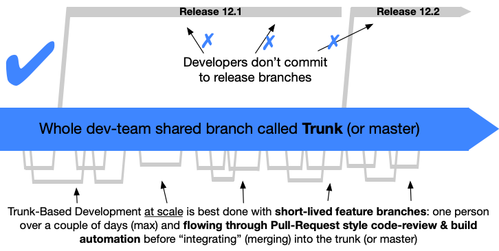

# Charon Branching and Release Model

We follow [Trunk Based Development](https://trunkbaseddevelopment.com/) as a branching model for this repo.

> Trunk based development has been identified by the [DORA research program](https://www.devops-research.com/research.html) as one of the set of capabilities that drive higher software delivery and organizational performance.

## Overview:

- Another way to think of it is: *micro-commits on stable master*.
- We just call our trunk/master branch “main”.
- A single GitHub issue can (and probably should) be broken into multiple incremental “micro-commits” / ”micro-PRs” / “short-lived feature branches”.
- A big feature/ticket/change is split into multiple sequential micro-commits, that each introduce a small incremental change. All while never breaking trunk!
- CI is run on each commit on trunk, and if a failure is detected, fixing it is the highest priority for the team since it is basically a global blocker.
- Micro-commits ensure fast and early code reviews and that improves velocity and increases alignment.
- Micro-commits are pushed for review and then squash-merged into trunk. This process repeats until the ticket or feature has been completed.
- It is possible to do stacked diffs (multiple open dependent PRs), but this often requires tricky rebases followed by force-pushes that cause PR comments to become “outdated”.

## Controlled introduction of change:

- Since a feature cannot be added as a single big merge of a big feature branch, tools and patterns are required that allow gradual controlled introduction of increment changes without breaking.
- New code can be added as “dead code”. So not integrated into the actual program yet. Once it is properly complete, it can be integrated in a single PR.
- Some features should however not be enabled straight into prod/mainnet, but should be rolled-out slowly being first tested in `alpha` (internal devnet only), then `beta` (internal and external testnet), and then only `stable` (enabled everywhere). This can be achieved by simple [feature switches](https://trunkbaseddevelopment.com/feature-flags/) (if statements) that enable features based on their `feature_set` status.
- Another powerful pattern to gradually introduce change is [branching by abstraction](https://trunkbaseddevelopment.com/branch-by-abstraction/). This basically introduces an abstraction layer at the point where a new feature has to replace an old feature (like an interface). Using dependency injection, the new feature can be integrated during testing/staging while the old feature is still being used in production.
- Note that both feature switches and/or abstraction layers used to roll out a feature should be removed once released to prod/main-net.

### Release Process

Charon is set up to create a release with Github Actions triggered by a tag. To create a new release:

The important aspects of the release process are:
- Releases are cut from release branches, not the main branch. Release branches are named `main-v0.X`.
- Release candidates, `v0.X.Y-rc[1-99]`, are created for each patch release from commits in the release branch. They are thoroughly tested both internally and externally before a release is created.
- Critical patches and fixes to releases are cherry-picked from main to the release branch.
- The Charon binary version, `charon version`, are inferred from git tags at build time using `ldflags`, not hardcoded app/version versions.
- Hardcoded Charon app/version is only used to indicate branch type and major version, `v0.X-rc` for release branches or `v0.Y-dev` for main branch.

The process to follow for the next v0.16.0 release is the following:
1. Note the previous release was v0.15.X.
2. When approaching the release, the dev team identifies a “release captain” who is responsible for driving the release process.
3. The dev team then focuses on tickets required to be included in the release.
4. The dev team also avoids adding risky or large changes during this “pre-release” period.
5. When all relevant changes have been included in main, a new “release branch”. It must be called `main-v0.16`.
   - Release branches are called `main-v0.X`
   - Release branches are high risk branches, and must be treated with the same security mindset as the `main` branch.
   - Note that github branch matching doesn’t support OR logic, so we chose a common `main*` prefix to identify all protected branches.
6. After the release branch has been created, the `main` branch app/version is manually updated to `v0.17-dev` and add `v0.17` to `version.Supported()` versions.
   - `v0.X-dev` indicates that the code is in the main branch.
   - It also indicates this is development only code not an official release.
   - It also indicates all code with this version would be included in the `v0.17.0` release. It indicates "pre-v0.17.0" but "post-v0.16.X".
7. The first commit on the `main-v0.16` release branch must manually update the app/version to `v0.16-rc`.
   - `v0.X-rc` indicates that the code is in a release branch.
   - It also indicates this is cherry-picked commits and fixes included in an official release.
   - It does not indicate which `v0.X.Y` release the commit will be included in.
8. To create a release (`v0.16.X[-rcY]`), someone with git tag privileges creates and pushes such a git tag to the latest commit on the release branch.
   - Note that the `build-push-release` action should dynamically update the app/version to the value of the git tag when building the docker image.
9. Before a `v0.16.X` release is created, a `v0.16.X-rc[1-99]` release candidate needs to be created and thoroughly tested both internally and externally.
10. After a `v0.16.X` release was created, the release notes need to be created.
   - The release github action does auto generate release notes.
   - If they are incorrect, manual release notes can be created via: `go run testutil/genchangelog/main.go --range=v0.15.0..v0.16.0`.

Note that images are built and tagged for each commit on the main and release branch using the app/version tag, e.g. `v0.X-dev` for `main`, and `v0.X-rc` for release branches. Main branch commits are also tagged with `latest`.

Note that any commit on main that affects the backwards compatibility must update `app/version.Supported` versions.

Note that commits on release branches MUST NOT affect the backwards compatibility nor modify the `app/version.Supported` versions.
