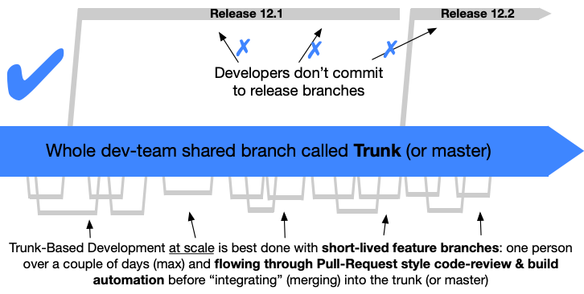

# Charon Branching and Release Model

We follow [Trunk Based Development](https://trunkbaseddevelopment.com/) as a branching model for this repo.

> Trunk based development has been identified by the [DORA research program](https://www.devops-research.com/research.html) as one of the set of capabilities that drive higher software delivery and organizational performance.

## Overview:

- Another way to think of it is: *micro-commits on stable master*.
- We just call our trunk/master branch “main”.
- A single GitHub issue can (and probably should) be broken into multiple incremental “micro-commits” / ”micro-PRs” / “short-lived feature branches”.
- A big feature/ticket/change is split into multiple sequential micro-commits, that each introduce a small incremental change. All while never breaking trunk!
- CI is run on each commit on trunk, and if a failure is detected, fixing it is the highest priority for the team since it is basically a global blocker.
- Micro-commits ensure fast and early code reviews and that improves velocity and increases alignment.
- Micro-commits are pushed for review and then squash-merged into trunk. This process repeats until the ticket or feature has been completed.
- It is possible to do stacked diffs (multiple open dependent PRs), but this often requires tricky rebases followed by force-pushes that cause PR comments to become “outdated”.

## Controlled introduction of change:

- Since a feature cannot be added as a single big merge of a big feature branch, tools and patterns are required that allow gradual controlled introduction of increment changes without breaking.
- New code can be added as “dead code”. So not integrated into the actual program yet. Once it is properly complete, it can be integrated in a single PR.
- Some features should however not be enabled straight into prod/mainnet, but should be tested in dev/devnet or staging/testnet first. This can be achieved by simple [feature switches](https://trunkbaseddevelopment.com/feature-flags/) (if statements) that integrate new features based on the environment (e.g. only enable feature X in testnet). TODO(corver): Add feature switch functionality.
- Another powerful pattern to gradually introduce change is [branching by abstraction](https://trunkbaseddevelopment.com/branch-by-abstraction/). This basically introduces an abstraction layer at the point where a new feature has to replace an old feature (like an interface). Using dependency injection, the new feature can be integrated during testing/staging while the old feature is still being used in production.
- Note that both feature switches and/or abstraction layers used to roll out a feature should be removed once released to prod/main-net.

### Release Process

Charon is set up to create a release with Github Actions triggered by a tag. To create a new release:

1. Ensure all tests are passing
1. Do a quick smoke test by running charon-docker-compose
1. Identify what is the version of the release.
1. Push a PR that bumps charon version global variable, see example https://github.com/ObolNetwork/charon/pull/312
1. Merge above PR, checkout latest main, and tag it: `git tag <version> && git push --tags`
1. Generate changelog: `go run testutil/genchangelog/main.go -range=<prev_version>..<version>`
1. Edit the auto-generated release on github: `https://github.com/ObolNetwork/charon/releases/tag/<version>`
