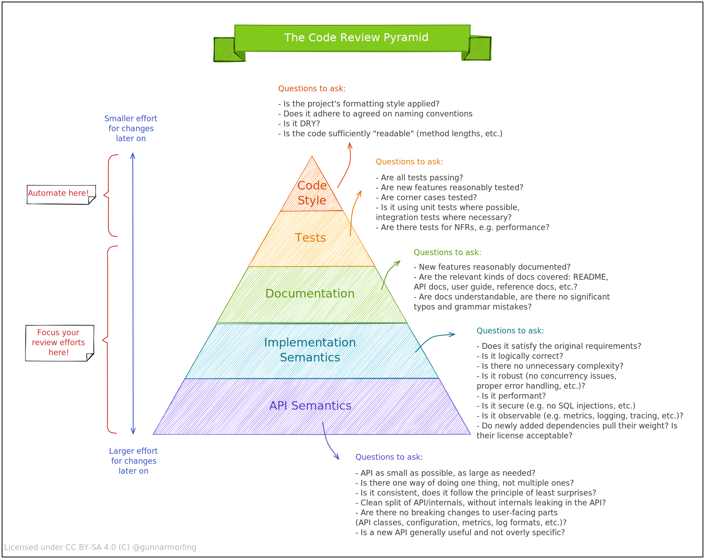

# Contributing to Charon

🎉 Thanks for taking the time to contribute, we really appreciate it.

To get started, check out the [Obol Docs](https://docs.obol.tech/) and other Charon repo [docs](.).

We keep a simple set of guidelines to streamline the contribution process,
loosely based on the [Atom contributing guide](https://github.com/atom/atom/blob/master/CONTRIBUTING.md).

## Responsible Disclosure

⚠️ We take the security of our users very seriously.
If you believe you have found a security issue, please **responsibly disclose** it to `security@obol.tech`
instead of opening a public issue or PR on GitHub.

## Coordinating work flows

- If you have found a bug...
    - Check for existing bug reports of the same issue in GitHub.
    - Do not post about it publicly if it is a suspected vulnerability to protect Obol's users;
      instead, use `security@obol.tech`.
    - Maybe send a message in relevant community channels if you are unsure whether you are seeing a technical issue.
    - Open a GitHub issue if everything else checks out 🤓
- If you're envisioning a larger feature or are just looking for a discussion,
  let's chat in the [Obol Discord](https://discord.com/invite/n6ebKsX46w) under `#general`.
    - A quick sync before coding avoids conflicting work and makes large PRs much more likely to be accepted.
    - 👀 The Discord channel is currently _invite-only_ to prevent spam. Please ping a team member to get access.

## Submitting changes

### Community Contributions (Pull Requests)

Feel free to fork the Charon repo and submit a pull request with your suggested changes.

You will then need to sign our Contributor License Agreement (CLA), which will show up as a comment
from a bot in this pull request after you open it. We cannot review code without a signed CLA.

As mentioned above, please file an associated issue if this pull request is non-trivial and
requires context for our team to understand. All features and most bug fixes should have
an associated issue with a design discussed and decided upon. Small bug fixes don't need issues.

New features and bug fixes must have tests. Documentation may need to be updated. If you're
unsure what to update, open the PR and we'll discuss during review.

Note that PRs updating dependencies and new Go versions are not accepted. Please file an issue instead.

Note: PRs can only be merged by obol-bulldozer bot. It is author's responsibility to add label `merge when ready` after getting approval.

> TL;DR: Open an Issue with details and motivation behind a PR.

### Chore PRs

We do not accept chore PRs such as fixing typos or trivial enhancements. For a meaningful improvement, we encourage contributors to submit an issue first, get a response from the core team, and then proceed with implementation and a PR.

### Core Dev Contributions

- Publish your work in a branch under this [charon repo](https://github.com/ObolNetwork/charon).
- Keep track of all roadmap and feature work, as well as bug fixes and smaller changes via GitHub [issues](https://github.com/ObolNetwork/charon/issues).
- Suggested branch names: `<name>/<feature>`, e.g. `oisin/improve-docs` or `richard/fix-discv5-panic`.
- Configure Git to use your `obol.tech` email.

## Style Guide

### Micro-commits on stable trunk

> TL;DR: Introduce change in small increments

- Please see the [Branching and Release Model](branching.md) for more details about how we do branching and releases.
- Multiple PRs per issue are encouraged.
- This ensures small PRs that are easy to review, merge and test.
- The issue can be closed once all PRs are completed.
- Keeping track of completed and planned PRs via a checklist in the issue is a great idea.

### PR Template

- **PRs are always squash merged into main**.
- The PR title and body are used as the final squash-merged git commit message.
- The PR's original git commits are therefore lost (so naming isn't specified)
- **PR title format** is defined as:
  - Following the [Go team's commit format](https://github.com/golang/go/commits/master): `package[/path]: concise overview of change`
  - Prefix identifies the primary package affected by the change.
  - Prefix can be a single or double hierarchical package name, but not three or more. E.g. `app` , or `app/tracer`.
  - The rest of the title must be a concise high-level overview in the present tense and starting with lower case.
- **PR body format** is defined as:
  - Start with a detailed description of the change.
  - Description should use proper grammar in present tense.
  - Ends with a list of tags (some required, others optional) (`^tag: value of this tag\n`):
  - `category`: required; one of: `refactor`, `bug`, `feature`, `docs`, `release`, `tidy`, `fixbuild`.
  - `ticket`: required; URL of the Github issue just a reference, E.g. `#123` or `none`.
  - `feature_flag`: optional; feature flag (as per `app/featureset` package) enabling/disabling this code.
- Examples:
```
runner/tracer: add jaeger otel exporter

Adds the jaeger exporter to our opentelemetry infra.

category: feature
ticket: #206
feature_flag: jaeger_tracing
```
```
docs: improve contributing.md

Fix typos in `contributing.md` and improves language.

category: docs
ticket: none
```

### Dev tools, git hooks and linters.

Charon is configured with [pre-commit](https://pre-commit.com) **githooks** that ensures pull
requests adhere to a minimum standard and are consistent. The githooks are run as a GitHub action
for each PR commit. But it is highly recommended running the githooks locally while developing for faster feedback.

To install githooks:
- Follow installation instructions [here](https://pre-commit.com/#installation) to install the `pre-commit` tool.
- Once installed, run `pre-commit install` in the project's root directory. This will set up the hooks.
- Note you can skip the hooks by committing with `-n`: `git commit -n -m "look mom no githooks"`

To update githooks:
```sh
pre-commit clean
```

The **linter** used is [golangci-lint](https://golangci-lint.run/). It runs as part of the githooks and is configured in [.golangci.yml](../.golangci.yml)

Different **dev tools** are used throughout the code base and are defined and installed from [tools.go](../tools.go). To install the dev tools run: `go generate tools.go`

## Code Review
We tend to closely follow the following code review structure:
<div></div>

## Anything missing?

This is a living document. Feel free to improve the contribution guide.
